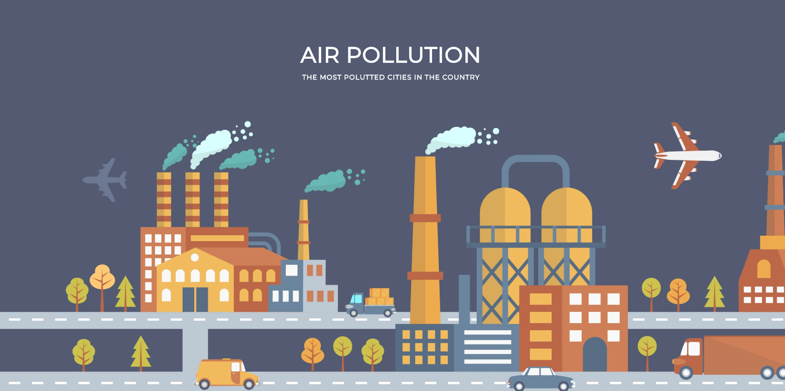

# The Most Polluted Cities

## Table of contents
* [General info](#general-info)
* [Technologies](#technologies)
* [Setup](#setup)
* [Contact](#contact)

## General info
Simple application showing most polluted cities in the country and value of air pollution.

## Technologies
* HTML5
* CSS3
* React JS
* API

## Setup
To run this project, install it locally using npm:

* Clone this repository
$ git clone https://github.com/ewelina-slepko/Most-polluted-cities

* Go into the repository
$ cd Most-polluted-cities

* Install dependencies
$ npm install

* Run the app
$ npm start

## Contact
Created by Ewelina Ślepko (slepko.ewelina@gmail.com) - feel free to contact me!
